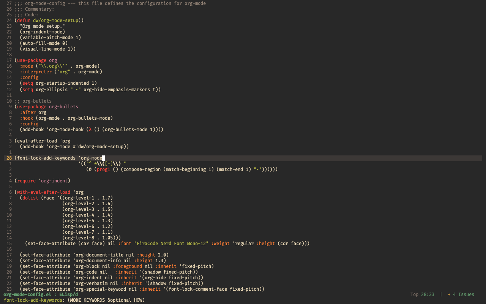

# Emacs Config files

My emacs config files. They are mainly focused on OSX but should work on any OS (although I cannot guarantee it).
It is reccomended to have the latest Emacs version (especially 29.2 or greater) otherwise you might encounter some unforseen bugs and errors.
I use god-mode heavily so if bindings feel long, you are free to change them at your own measure on your own system.

## Preview



## Installation

Just run this command to install the config files:

```
git clone https://github.com/AnshumanNeon/.emacs.d.git ~/.emacs.d
```

## Updates

To have your configs updated with mine:
* clone the repo with the last command (if not done so yet)
* pull from the repo to have it updated:
```
git pull origin master
```

## Customising Config

To customise the configuration to your own taste, you are free to do so! Just clone the repo and make changes in the files for your own config.
